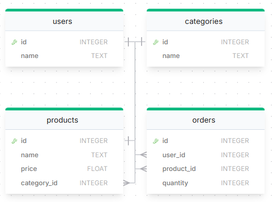

# [Заказы пользователей](https://solvit.space/coding/2929)

Найти пользователей, которые совершили заказы на товары из категории `'Electronics'`, с указанием общей суммы заказов по этой категории.

Ответ должен содержать поля:
* `user_id`
* `user_name`
* `total_order_value`

