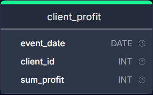

[Динамика дохода клиентов](https://solvit.space/coding/2959)

Посчитайте долю прибыли на каждый день от прибыли того же клиента в предыдущий день.

Формула: `Доля = Сумма прибыли x день/Сумма прибыли (x-1) день`.

Вывести: дату, клиента, прибыль, долю. Отсортируйте результат по возрастанию даты, а затем по id клиента.

Поля в результирующей таблице: `event_date`, `client_id`, `sum_profit`, `profit_ratio`.

Округлите значения `profit_ratio` до 2 знаков после запятой.

Если у клиента отсутствует запись о прибыли за предыдущий день, эти строки исключаются из результата.

